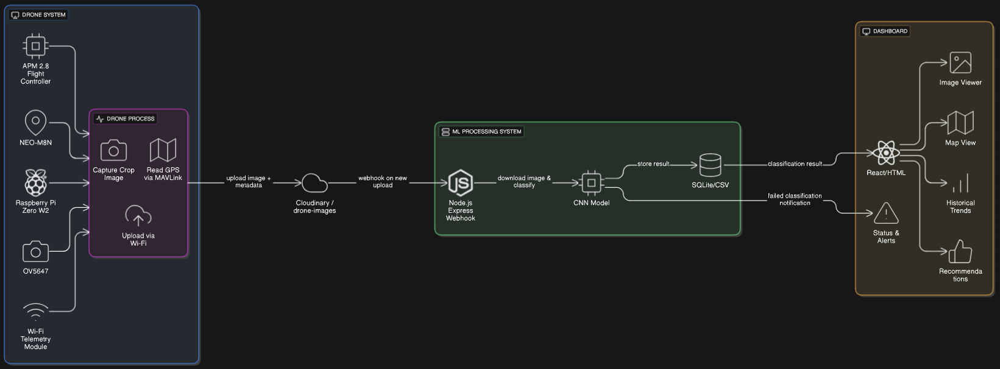

# Epics-AI

## Overview

Epics-AI is an end-to-end AI-powered crop monitoring system using a drone equipped with a Raspberry Pi, camera, GPS, and telemetry. The system captures crop images, uploads them to the cloud, processes them with a machine learning model, and visualizes results on a dashboard.

---

## System Architecture Diagram



**Architecture Overview:**

- **Drone System**
  - APM 2.8 Flight Controller
  - GPS Module (NEO-M8N)
  - Raspberry Pi Zero W2
  - Pi Camera (OV5647)
  - Wi-Fi Telemetry Module

- **Process Flow from Drone**
  - Pi captures crop images
  - Reads GPS coordinates via MAVLink
  - Uploads image to Cloudinary via Wi-Fi

- **Cloud Storage**
  - Cloudinary folder: `/drone-images`
  - Stores image and metadata

- **ML Processing System (Laptop or Server)**
  - Node.js Express Webhook Server
  - Receives Cloudinary webhook on new upload
  - Downloads image
  - Runs ML classifier (e.g. CNN model)
  - Stores classification result in SQLite/CSV

- **Optional Dashboard**
  - Simple frontend (React or HTML)
  - Displays image + classification status
  - Shows map coordinates

---

## Components

### 1. Drone System
- **APM 2.8 Flight Controller**
- **GPS Module (NEO-M8N)**
- **Raspberry Pi Zero W2**
- **Pi Camera (OV5647)**
- **Wi-Fi Telemetry Module**

### 2. Process Flow from Drone
- Pi captures crop images
- Reads GPS coordinates via MAVLink
- Uploads image to Cloudinary via Wi-Fi

### 3. Cloud Storage
- **Cloudinary folder:** `/drone-images`
- Stores image and metadata

### 4. ML Processing System (Laptop or Server)
- **Node.js Express Webhook Server**
- Receives Cloudinary webhook on new upload
- Downloads image
- Runs ML classifier (e.g. CNN model)
- Stores classification result in SQLite/CSV

### 5. Optional Dashboard
- Simple frontend (React or HTML)
- Displays image + classification status
- Shows map coordinates

---

## Data & Control Flow

- **Data Flow:** Drone → Cloudinary → Webhook → ML → Dashboard
- **Control Flow:** Classification result/alerts → Dashboard

---

## How to Add an Image to the README

1. Place your image (e.g., `diagram1.png`) in the `assets/` folder (create it if it doesn't exist).
2. Reference it in your README using Markdown:

   ```markdown
   
   ```

---

## Quick Start

1. Clone the repo and install dependencies:
   ```bash
   npm install
   ```
2. Set up your `.env` file with Cloudinary credentials.
3. Run the uploader script on the Raspberry Pi:
   ```bash
   node RaspberryPi_Uploader/upload-script.js
   ```
4. Set up the ML processing server and dashboard as per your requirements.